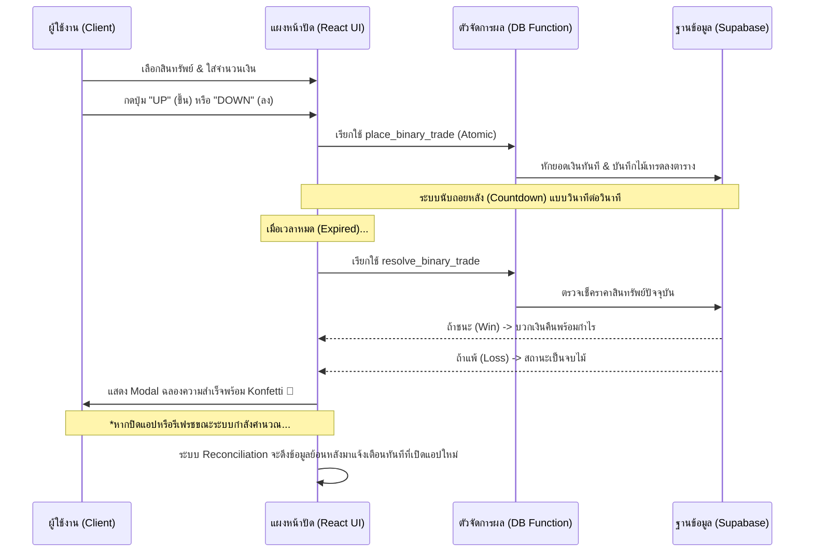

# 📊 MetaStock: สรุปภาพรวมและขั้นตอนการทำงานของระบบ
> "นวัตกรรมการเทรดความเร็วสูง พร้อมระบบจัดการทางการเงินอัจฉริยะ"

````carousel

<!-- slide -->

<!-- slide -->

````

---

## 1. MetaStock คืออะไร? (Project Overview)
**MetaStock** คือแพลตฟอร์มการลงทุนยุคใหม่ที่รวมเอาการเทรด **Binary Options** และการจัดการพอร์ตสินทรัพย์ดิจิทัลเข้าไว้ด้วยกันในที่เดียว

### 💡 จุดเด่นของโครงการ:
- **Zero-Latency UI**: หน้าจอการเทรดที่รวดเร็ว ไม่กระตุก เพื่อไม่ให้พลาดจังหวะสำคัญ
- **Seamless Wallet**: ระบบกระเป๋าเงินที่รองรับทั้งการฝากเงินผ่าน QR Code และการถอนเข้าธนาคาร/USDT
- **Powerful Admin Control**: ระบบหลังบ้านที่แอดมินสามารถควบคุมยอดเงิน, จัดการบทบาทสิทธิ์การใช้งาน และดูพฤติกรรมการเทรดได้แบบ Real-time
- **OTP Security System**: ระบบยืนยันตัวตนผ่านอีเมล (EmailJS) พร้อมหัวข้อตามสถานการณ์ (ยืนยัน/กู้รหัส/เปลี่ยนอีเมล)
- **Multi-Language**: รองรับทั้งภาษาไทยและอังกฤษอย่างสมบูรณ์ รวมถึงรายงานผลการเทรดในหน้าต่างแจ้งเตือนและอีเมล
- **Persistence & Recovery**: ระบบจดจำสถานะหน้าเว็บและกู้คืนการแจ้งเตือนผลการเทรดอัตโนมัติ (Reconciliation) แม้จะปิดแอปหรือเน็ตหลุด

---

## 2. ขั้นตอนการเทรด (Binary Options Workflow)
ฟีเจอร์หลักของระบบคือการเทรดแบบ **Up/Down** ที่มีความแม่นยำสูง



---

## 3. ระบบกระเป๋าเงิน (Financial Workflow)
ขั้นตอนการฝากและถอนเงินที่เน้นความง่ายและรัดกุม

### 📥 ขั้นตอนการฝากเงิน (Deposit)
1.  **เลือกช่องทาง**: ผู้ใช้เลือกธนาคารหรือ USDT
2.  **Generate QR**: ระบบสร้าง QR Code (PromptPay) หรือแสดงที่อยู่กระเป๋า USDT
3.  **แจ้งโอน**: เมื่อโอนเสร็จ ผู้ใช้กด "แจ้งโอนเงิน" ในแอป
4.  **Admin Verify**: แอดมินตรวจสอบยอดเงินในระบบหลังบ้านและกดอนุมัติยอดเข้าวอลเล็ท

### 📤 ขั้นตอนการถอนเงิน (Withdraw)
1.  **ระบุข้อมูล**: ผู้ใช้ใส่ชื่อธนาคาร เลขบัญชี และจำนวนเงิน
2.  **Security Check**: ระบบเช็กยอดคงเหลือในกระเป๋า (ต้องเพียงพอ)
3.  **Support Notification**: กรณีถอนยอดใหญ่ ระบบจะแจ้งให้ติดต่อฝ่ายสนับสนุนเพื่อความปลอดภัย

---

## 4. แผงควบคุมผู้ดูแลระบบ (Admin Dashboard)
เครื่องมือสำหรับเจ้าของโครงการในการบริหารจัดการ

- **User Management**: ค้นหาผู้ใช้รายบุคคล, จัดการสถานะเจ้าหน้าที่ (Admin/User) และดูประวัติย้อนหลัง
- **Balance Override**: แอดมินสามารถ "เติมเงิน" หรือ "แก้ไขยอดเงิน" ให้ผู้ใช้ได้โดยตรง
- **Identity & Access**: ระบบตรวจสอบสิทธิ์การใช้งานแบบ Step-by-step มั่นใจได้ในความปลอดภัยของข้อมูล
- **Contact Setup**: ตั้งค่า Line, Telegram, เบอร์โทรศัพท์ ที่จะแสดงให้ลูกค้ารายย่อยเห็น
- **Activity Dashboard 3.0**: ดูความเคลื่อนไหวของผู้ใช้แบบ Unified จากทุกแหล่ง (Transaction, Trade, Login) พร้อม:
  - กรองตามช่วงวันที่และประเภทกิจกรรม
  - ค้นหาผู้ใช้ด้วยรหัสลับ (Private Code) 6 หลัก พร้อมปุ่ม Paste
  - ระบบ Pagination 50 รายการ/หน้า เพื่อประสิทธิภาพสูงสุด

---

## 5. เทคโนโลยีเบื้องหลัง (Technology Stack)
เราเลือกใช้เทคโนโลยีระดับโลกเพื่อให้ระบบเสถียรที่สุด:

| เทคโนโลยี | หน้าที่ |
| :--- | :--- |
| **React 19** | หน้าจอการใช้งานที่รวดเร็วและทันสมัย (ใช้ `React.memo` + `useTransition`) |
| **Supabase** | ฐานข้อมูลแบบ Real-time และระบบจัดการสิทธิ์ |
| **Framer Motion** | ระบบแอนิเมชันที่ใช้เฉพาะจุด (Toast, Modals) — ถอดออกจากส่วนแสดงข้อมูลจำนวนมากเพื่อ Performance |
| **Tailwind CSS** | การออกแบบที่สวยงามและรองรับทุกหน้าจอ (Responsive) |
| **PostgreSQL** | ระบบจัดเก็บข้อมูลสำคัญและ Atomic RPC Functions |
| **EmailJS** | ระบบส่งรหัส OTP และการสื่อสารผ่านอีเมลที่รวดเร็ว |

---

> [!TIP]
> **หมายเหตุ**: คู่มือ SQL และการตั้งค่าเชิงลึก ดูได้ที่ไฟล์ [คู่มือการติดตั้ง_ฉบับสมบูรณ์.md](file:///c:/Users/xzhen/OneDrive/Documents/Dev/clone/Meta-Bridge/คู่มือ/คู่มือการติดตั้ง_ฉบับสมบูรณ์.md) และดู Release Notes ล่าสุดที่ [Patch_Update_2026-04-12.md](file:///c:/Users/xzhen/OneDrive/Documents/Dev/clone/Meta-Bridge/คู่มือ/Patch_Update_2026-04-12.md)
